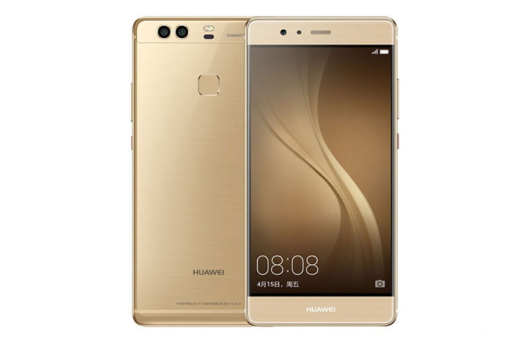

# NetHunter Kernel for Huawei P9 (EVA)

> **A native NetHunter kernel for the Huawei P9 — 802.11 monitor mode and frame injection implemented directly in the kernel, with no dependency on `libnexmon.so`.**

This project brings a lib-free native monitor mode and frame injection implementation for the Broadcom BCM43455 chip to the Huawei P9 (EVA family). In addition to Nexmon, the kernel integrates CAN bus, Bridge, VLAN, USB serial support, and drivers for a range of common external Wi-Fi adapters.



| Item | Value |
|---|---|
| Device | Huawei P9 (EVA-L09 / EVA-L19 / EVA-AL00) |
| SoC | Kirin 955 |
| Wi-Fi chip | Broadcom BCM43455 (SDIO) |
| ROMs | EMUI 8 (Android 8) / LineageOS 16 (Android 9) |
| Kernel | Linux 4.4.53 |
| Status | ✅ Boots, monitor + injection verified |

---

## What is the Linux kernel?

The Linux kernel is the lowest layer of an operating system — it handles CPU scheduling, memory management, device drivers, the network stack, and everything else the user space cannot see but cannot live without. Android itself runs on top of the Linux kernel: Wi-Fi, Bluetooth, and USB drivers are all loaded by the kernel.

The story starts in 1991. That year, a 21-year-old student at the University of Helsinki named **Linus Torvalds** started writing a small Unix-like kernel as a personal hobby. He posted a now-famous message on a newsgroup:

> *"I'm doing a (free) operating system (just a hobby, won't be big and professional like gnu)…"*

He had no idea that this "just a hobby" project would, more than thirty years later, become the kernel of the vast majority of the world's servers — from Android phones to supercomputers, from routers to Tesla infotainment systems. Linus himself became one of the most influential figures in the open-source movement.

A NetHunter kernel = **the original Android Linux kernel, with the extra drivers and configuration needed by Kali NetHunter added on top**, giving the phone penetration-testing capabilities.

> 📖 For more background on the Linux kernel (Linus's story, the kernel 4.x build process, cross-compilation toolchain notes, etc.), see [`README-linux.md`](./README-linux.md).

## What is Kali NetHunter?

Kali NetHunter is the official Kali Linux port to the Android platform, maintained by the Offensive Security team. It lets you run the full Kali toolset on a phone — plug in a USB Wi-Fi adapter that supports monitor mode, and you can do Wi-Fi sniffing, handshake capture, man-in-the-middle attacks, BadUSB, HID injection, and more.

The NetHunter community maintains kernel branches for a large number of devices (`kali-nethunter-kernels`), adapting different Android models into NetHunter-capable devices.


## What is Nexmon?

Nexmon is a security research project from **TU Darmstadt (Technische Universität Darmstadt)** in Germany. By **patching the firmware** of Broadcom / Cypress Wi-Fi chips, it bypasses the limitations of the stock firmware and enables raw 802.11 frame transmission and reception — that is, Wi-Fi sniffing and injection.

The traditional Nexmon approach relies on a user-space library, `libnexmon.so`: user tools talk to the kernel through this library, and the kernel then forwards frames to the firmware.

**The core work of this project**: move the entire pipeline **directly into kernel space** (by patching the `bcmdhd` driver and the `nl80211` subsystem), so that **`libnexmon.so` is no longer needed**. Any tool that supports the standard `nl80211` injection interface (`aireplay-ng`, `mdk4`, `wifite`, etc.) works out of the box.

Patches: [apk0mix5900/nexmon-p9-native](https://github.com/apk0mix5900/nexmon-p9-native)


---

## Supported features

```

BT_RFCOMM          INTERNAL_BT         RTL_BT              HID-4
Injection          RTL8187             RTL8192CU           RTL8XXXU
88XXAU             ATH9K_HTC           CARL9170            ATH6KL_USB
RT2500USB          RT73USB             RT2800USB           MT7601U
ZD1211RW           NFS                 SDR                 HackRF
Nexmon-Kernel-Injector (BCM43455)      nexmon              USB_SERIAL (ko)
CAN (ko)

```

**Highlights:**

- **Nexmon-Kernel-Injector (BCM43455)** — the project's own lib-free native monitor + injection implementation, for the BCM43455 Wi-Fi chip built into the P9
- **CAN (ko)** — CAN bus modules (`can`, `can-raw`, `can-bcm`, `can-gw`, `vcan`, `slcan`, `gs_usb`, `kvaser_usb`, `peak_usb`, `usb_8dev`) for automotive bus reverse engineering
- **USB_SERIAL (ko)** — USB serial support (CH340, CP2102, FT232, PL2303, etc.), for embedded development and external device debugging
- **88XXAU / RTL8187 / RTL8192CU / …** — drivers for mainstream external Wi-Fi adapters, for use with OTG

---

## Source and patches

| Item | Link |
|---|---|
| Full kernel source | [apk0mix5900/android_kernel_huawei_hi3650](https://github.com/apk0mix5900/android_kernel_huawei_hi3650) |
| Nexmon patches (bcmdhd subset + patches) | [apk0mix5900/nexmon-p9-native](https://github.com/apk0mix5900/nexmon-p9-native) |
| Upstream kernel source | [vvvbbbcz/android_kernel_huawei_hi3650](https://gitlab.com/vvvbbbcz/android_kernel_huawei_hi3650) |
| Kali NetHunter kernel repo | [kalilinux/nethunter/build-scripts/kali-nethunter-kernels](https://gitlab.com/kalilinux/nethunter/build-scripts/kali-nethunter-kernels) |

**Modified files:**

- `drivers/huawei_platform/connectivity/bcm/wifi/driver/bcmdhd/wl_cfg80211.c`
- `drivers/huawei_platform/connectivity/bcm/wifi/driver/bcmdhd/wl_cfg80211.h`
- `drivers/huawei_platform/connectivity/bcm/wifi/driver/bcmdhd/dhd_linux.c`
- `net/wireless/nl80211.c`

Every modified `bcmdhd` file is accompanied by a `*.orig` copy of the **unmodified original**, making diffs easy.

---

## Building

```bash
source env.sh

make ARCH=arm64 O=../out mon_nh_ultra_defconfig
make ARCH=arm64 O=../out -j4
```

Output:

· ../out/arch/arm64/boot/Image.gz-dtb — kernel image
· ../out/**/*.ko — individual modules (aggregate with modules_install)

---

Known issues

⚠️ Huawei #N build counter limitation

I know this may sound crazy, but it's true — I tried building many kernels, and I confirmed through repeated compile-and-flash cycles that once the kernel's localversion counter reaches two digits or more (i.e. #10 and beyond), the phone fails to boot normally.

Huawei's bootloader (or the kernel's own localversion check) refuses to boot a kernel whose localversion counter is ≥ 10. For example, on the 10th build the version string becomes #10, and at that point the phone gets stuck in a boot loop and cannot reach the system.

Workaround: reset the counter before building:

```bash
echo 0 > .version
```

Or patch scripts/mkcompile_h to cap the counter.

Verified bootable: the image in this repository was built as #2.

---

## Credits

Sincere thanks to the following individuals and teams (in no particular order):

- **[Kali NetHunter Team](https://www.kali.org/get-kali/#kali-mobile)** — for providing such a powerful penetration-testing environment on Android  
  <https://www.kali.org/get-kali/#kali-mobile>
- **[Nexmon Team](https://github.com/seemoo-lab/nexmon)** (TU Darmstadt / SEEMOO Lab) — their research on Broadcom firmware patching is the foundation of everything in this project  
  <https://github.com/seemoo-lab/nexmon>
- **[vvvbbbcz](https://gitlab.com/vvvbbbcz)** — for laying down the complete kernel source foundation for the P9, allowing me to stand on the shoulders of giants and keep going  
  <https://gitlab.com/vvvbbbcz/android_kernel_huawei_hi3650>
- **[yesimxev](https://gitlab.com/yesimxev)** — for the encouragement and support throughout the project  
  <https://gitlab.com/yesimxev>
  
  
- **and to all the friends who helped and encouraged me along the way**

----

License

This project is based on the upstream Linux kernel source and is licensed under GPL-2.0.

The original kernel source comes from vvvbbbcz/android_kernel_huawei_hi3650 (branch upstream).

---

## A word from the author

This is my first Linux kernel project — my debut work. I hope you like it.

— [apk0mix5900](https://github.com/apk0mix5900)
